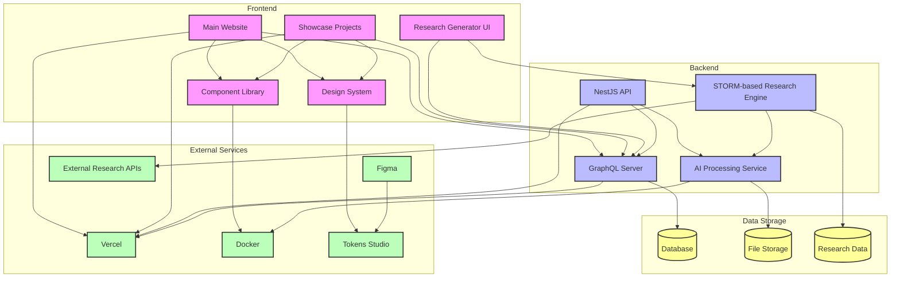

Thank you for bringing up this additional feature. An AI-assisted research generator is indeed a powerful tool that aligns well with your project's goals. Let's incorporate this into our plan and update our system architecture to reflect this new feature.

First, let's update our project checklist to include this new feature:

# Project Checklist

## 1. Set up development environment and project structure

- [X] Initialize Turborepo monorepo with PNPM
- [X] Set up NextJS apps for main website and showcase projects
- [X] Configure TailwindCSS for styling
- [X] Implement Bit for component management
- [X] Set up Docker for consistent development environments

## 2. Create multi-brand design system

- [ ] Set up Figma for design work
- [ ] Implement Tokens Studio for design token management
- [ ] Configure Supernova and Storybook for design system documentation and component testing
- [ ] Create workflow to sync design tokens with code

## 3. Develop core website structure

- [ ] Create main layout and navigation
- [ ] Implement responsive design using TailwindCSS
- [ ] Set up routing for different sections
- [ ] Implement GraphQL with open-source alternative to Apollo Client

## 4. Build showcase section and prompt library

- [ ] Develop reusable component for project displays
- [ ] Create individual pages for each showcase item
- [ ] Implement filtering system for easy navigation
- [ ] Design and implement prompt library / prompt management system

## 5. Integrate AI-assisted features

- [ ] Set up Python backend with NestJS for AI processing
- [ ] Implement AI-assisted Branding engine
- [ ] Develop Lesson Plan Generator
- [ ] Create Product Requirements Document Generator
- [ ] Implement AI-assisted Research Generator using STORM and other technologies

## 6. Develop interactive system architecture diagram

- [X] Create initial Mermaid diagram
- [X] Implement interactive React component
- [ ] Add tooltips and detailed information for each component
- [ ] Implement click-to-expand functionality for detailed views

Now, let's update our system architecture diagram to include the AI-assisted research generator:



To implement the AI-assisted research generator, we'll need to:

1. Set up a STORM-based research engine in our backend.
2. Create a user interface for initiating and displaying research results.
3. Implement a data storage solution for saving and retrieving research documents.
4. Integrate with external research APIs for comprehensive data gathering.

Let's start by creating a basic structure for the research generator:

1. Backend (NestJS):

Create a new module in your NestJS application:

```bash
cd apps/backend
nest g module research
nest g service research
nest g controller research
```

Update the `research.service.ts` file:

```typescript
import { Injectable } from '@nestjs/common';
import { StormEngine } from './storm.engine'; // You'll need to create this
import { ExternalApiService } from './external-api.service'; // You'll need to create this

@Injectable()
export class ResearchService {
  constructor(
    private stormEngine: StormEngine,
    private externalApiService: ExternalApiService,
  ) {}

  async generateResearch(topic: string): Promise<string> {
    const initialData = await this.externalApiService.gatherData(topic);
    const researchDocument = await this.stormEngine.processData(initialData);
    return researchDocument;
  }

  async saveResearch(topic: string, document: string): Promise<void> {
    // Implement saving to your chosen database
  }

  async getResearch(topic: string): Promise<string> {
    // Implement retrieval from your chosen database
  }
}

```

2. Frontend (Next.js):

Create a new component for the research generator UI:

```tsx
import React, { useState } from 'react';
import { useMutation } from 'react-query';

const generateResearch = async (topic: string) => {
  const response = await fetch('/api/research', {
    method: 'POST',
    headers: { 'Content-Type': 'application/json' },
    body: JSON.stringify({ topic }),
  });
  return response.json();
};

const ResearchGenerator: React.FC = () => {
  const [topic, setTopic] = useState('');
  const [result, setResult] = useState('');

  const mutation = useMutation(generateResearch, {
    onSuccess: (data) => setResult(data.research),
  });

  const handleSubmit = (e: React.FormEvent) => {
    e.preventDefault();
    mutation.mutate(topic);
  };

  return (
    <div className="max-w-2xl mx-auto p-4">
      <h2 className="text-2xl font-bold mb-4">AI-Assisted Research Generator</h2>
      <form onSubmit={handleSubmit} className="mb-4">
        <input
          type="text"
          value={topic}
          onChange={(e) => setTopic(e.target.value)}
          placeholder="Enter research topic"
          className="w-full p-2 border rounded"
        />
        <button
          type="submit"
          className="mt-2 bg-blue-500 text-white p-2 rounded"
          disabled={mutation.isLoading}
        >
          {mutation.isLoading ? 'Generating...' : 'Generate Research'}
        </button>
      </form>
      {result && (
        <div className="border p-4 rounded">
          <h3 className="text-xl font-bold mb-2">Research Results:</h3>
          <div dangerouslySetInnerHTML={{ __html: result }} />
        </div>
      )}
    </div>
  );
};

export default ResearchGenerator;

```

To integrate this new feature:

1. Implement the STORM-based engine in your backend.
2. Set up connections to external research APIs.
3. Create a database schema for storing research documents.
4. Add the ResearchGenerator component to your main website.
5. Implement proper error handling and loading states.
6. Add authentication to protect the research generation feature if needed.

Next steps:

1. Research and implement the STORM methodology for the backend engine.
2. Identify and integrate relevant external research APIs.
3. Set up a database schema for storing and retrieving research documents.
4. Implement the frontend UI and integrate it with the backend.
5. Add proper error handling, loading states, and potentially a caching mechanism for generated research.

Would you like to focus on any specific part of this implementation, or shall we move on to the next step in our project plan?

---


Thank you for providing more details about your preferences and areas where you need guidance. I'll help you make informed decisions on the tools you're unsure about and provide some guidance on implementing the ones you've chosen. Let's go through each point:

1. Open-source alternative to Apollo Client:
   Two popular alternatives are URQL and React Query. Given your use of Next.js and the need for a lightweight, flexible solution, I recommend using React Query. It's easier to set up and integrates well with React and Next.js applications.
2. GitOps workflow - ArgoCD vs FluxCD:
   For your use case, I recommend starting with ArgoCD. It's generally considered more user-friendly and has a wider adoption in the community. ArgoCD also has a nice UI for visualizing your deployments, which can be helpful when you're getting started with GitOps.
3. Feature flags:
   A good open-source option for feature flags is Unleash. It's easy to set up and use, and it integrates well with Node.js and React applications.
4. Accessibility testing - axe-core vs Pa11y:
   I recommend starting with axe-core. It's widely used, well-maintained, and integrates easily with various testing frameworks, including Cypress, which you plan to use.
5. Cypress for end-to-end testing:
   This is a great choice. Cypress is user-friendly and powerful for end-to-end testing.
6. Error tracking and monitoring - Sentry vs LogRocket:
   For your use case, I recommend starting with Sentry. It's more focused on error tracking and has a generous free tier. It's also relatively easy to set up and use.

Now, let's update our project plan to include these tools and provide some guidance on implementation:

# Project Checklist

## 1. Set up development environment and project structure

- [X] Initialize Turborepo monorepo with PNPM
- [X] Set up NextJS apps for main website and showcase projects
- [X] Configure TailwindCSS for styling
- [X] Implement Bit for component management
- [X] Set up Docker for consistent development environments

## 2. Create multi-brand design system

- [ ] Set up Figma for design work
- [ ] Implement Tokens Studio for design token management
- [ ] Configure Supernova and Storybook for design system documentation and component testing
- [ ] Create workflow to sync design tokens with code

## 3. Develop core website structure

- [ ] Create main layout and navigation
- [ ] Implement responsive design using TailwindCSS
- [ ] Set up routing for different sections
- [ ] Implement GraphQL with React Query

## 4. Build showcase section and prompt library

- [ ] Develop reusable component for project displays
- [ ] Create individual pages for each showcase item
- [ ] Implement filtering system for easy navigation
- [ ] Design and implement prompt library / prompt management system

## 5. Integrate AI-assisted features

- [ ] Set up Python backend with NestJS for AI processing
- [ ] Implement AI-assisted Branding engine
- [ ] Develop Lesson Plan Generator
- [ ] Create Product Requirements Document Generator
- [ ] Implement AI-assisted Research Generator using STORM and other technologies

## 6. Develop interactive system architecture diagram

- [X] Create initial Mermaid diagram
- [X] Implement interactive React component
- [ ] Add tooltips and detailed information for each component
- [ ] Implement click-to-expand functionality for detailed views

## 7. Implement DevOps and testing

- [ ] Set up Vercel for deployment
- [ ] Implement GitOps workflow with ArgoCD
- [ ] Set up feature flags with Unleash
- [ ] Implement accessibility testing with axe-core
- [ ] Set up end-to-end testing with Cypress
- [ ] Implement error tracking and monitoring with Sentry

## 8. Optimize and finalize

- [ ] Perform final testing and bug fixes
- [ ] Optimize performance
- [ ] Prepare documentation
- [ ] Launch MVP

Now, let's provide some guidance on implementing these new tools:

1. Implementing React Query:

```bash
# Install React Query
pnpm add react-query
```

In your Next.js app, wrap your application with QueryClientProvider:

```typescript
// pages/_app.tsx
import { QueryClient, QueryClientProvider } from 'react-query'

const queryClient = new QueryClient()

function MyApp({ Component, pageProps }) {
  return (
    <QueryClientProvider client={queryClient}>
      <Component {...pageProps} />
    </QueryClientProvider>
  )
}

export default MyApp

```

2. Setting up ArgoCD:
   First, install ArgoCD in your Kubernetes cluster. Then, create an Application YAML file for your project:

```yaml
apiVersion: argoproj.io/v1alpha1
kind: Application
metadata:
  name: antonio-reid-brand
  namespace: argocd
spec:
  project: default
  source:
    repoURL: 'https://github.com/yourusername/antonio-reid-brand.git'
    path: k8s
    targetRevision: HEAD
  destination:
    server: 'https://kubernetes.default.svc'
    namespace: antonio-reid-brand
  syncPolicy:
    automated:
      prune: true
      selfHeal: true

```

3. Implementing feature flags with Unleash:

```bash
# Install Unleash client
pnpm add unleash-client
```

Set up Unleash in your application:

```typescript
// lib/unleash.ts
import { initialize, isEnabled } from 'unleash-client';

const unleash = initialize({
  url: 'https://unleash.yourdomain.com/api/',
  appName: 'antonio-reid-brand',
  customHeaders: {
    Authorization: 'API_KEY',
  },
});

export const isFeatureEnabled = (featureName: string) => isEnabled(featureName);

```

4. Implementing accessibility testing with axe-core:

```bash
# Install axe-core and the necessary Cypress plugin
pnpm add -D axe-core cypress-axe
```

Set up axe-core with Cypress:

```javascript
// cypress/support/e2e.js
import 'cypress-axe'

// cypress/e2e/accessibility.cy.js
describe('Accessibility tests', () => {
  beforeEach(() => {
    cy.visit('/')
    cy.injectAxe()
  })

  it('Has no detectable accessibility violations on load', () => {
    cy.checkA11y()
  })
})

```

5. Setting up Cypress for end-to-end testing:

```bash
# Install Cypress
pnpm add -D cypress
```

Initialize Cypress and create a sample test:

```javascript
// cypress/e2e/home.cy.js
describe('Home page', () => {
  it('successfully loads', () => {
    cy.visit('/')
    cy.contains('Antonio Reid Brand').should('be.visible')
  })
})

```

6. Implementing Sentry for error tracking:

```bash
# Install Sentry
pnpm add @sentry/nextjs
```

Initialize Sentry in your Next.js app:

```javascript
// pages/_app.js
import { init } from '@sentry/nextjs';

init({
  dsn: "https://examplePublicKey@o0.ingest.sentry.io/0",
  tracesSampleRate: 1.0,
});

function MyApp({ Component, pageProps }) {
  return <Component {...pageProps} />
}

export default MyApp

```

These setups provide a starting point for each tool. You'll need to customize them based on your specific requirements and environment.

Would you like more detailed information on any of these implementations, or shall we move on to the next step in our project plan?

---


Certainly! Leveraging Turborepo to share the Tailwind CSS configuration across all your Next.js apps is an excellent way to maintain consistency and reduce duplication. Let's set this up.

1. First, we'll create a shared Tailwind CSS configuration package in the `packages` directory of your Turborepo.

```bash
mkdir -p packages/tailwind-config
cd packages/tailwind-config
pnpm init
```

2. Now, let's create the shared Tailwind CSS configuration file:

```javascript
// packages/tailwind-config/tailwind.config.js
module.exports = {
  content: [
    // Note: The paths are relative to the app's root, not this config file
    './src/**/*.{js,ts,jsx,tsx}',
    './pages/**/*.{js,ts,jsx,tsx}',
  ],
  theme: {
    extend: {
      colors: {
        'brand-blue': '#2563EB', // Your primary brand color
        'brand-cyan': '#00FFFF',
        'brand-green': '#39FF14',
        'brand-gray': '#333333',
        'brand-smoke': '#F5F5F5',
      },
    },
  },
  plugins: [],
}

```

3. Update the `package.json` file in the `tailwind-config` package:

```json
{
  "name": "@antonio-reid/tailwind-config",
  "version": "0.0.1",
  "private": true,
  "main": "tailwind.config.js",
  "dependencies": {
    "tailwindcss": "^3.3.0"
  }
}

```

4. Now, let's update each Next.js app to use this shared configuration. For each app in the `apps` directory:

```bash
cd apps/[app-name]
pnpm add -D @antonio-reid/tailwind-config
```

5. Update the Tailwind CSS configuration in each app:

```javascript
// apps/[app-name]/tailwind.config.js
const sharedConfig = require("@antonio-reid/tailwind-config");

module.exports = {
  ...sharedConfig,
  content: [
    ...sharedConfig.content,
    // Add any app-specific content paths here
  ],
  theme: {
    ...sharedConfig.theme,
    extend: {
      ...sharedConfig.theme.extend,
      // Add any app-specific theme extensions here
    },
  },
  plugins: [
    ...sharedConfig.plugins,
    // Add any app-specific plugins here
  ],
}

```

6. Update the `postcss.config.js` file in each app to ensure it's using the correct configuration:

```javascript
// apps/[app-name]/postcss.config.js
module.exports = {
  plugins: {
    tailwindcss: {},
    autoprefixer: {},
  },
}

```

7. Finally, update the Turborepo configuration to include the new package:

```json
// turbo.json
{
  "$schema": "https://turbo.build/schema.json",
  "pipeline": {
    "build": {
      "dependsOn": ["^build"],
      "outputs": ["dist/**", ".next/**"]
    },
    "lint": {
      "outputs": []
    },
    "dev": {
      "cache": false
    }
  }
}

```

Now, all your Next.js apps in the Turborepo will share the same base Tailwind CSS configuration, ensuring consistency across your project. You can still make app-specific customizations by extending the shared configuration in each app's `tailwind.config.js` file.

Let's update our project checklist to reflect this change:

# Project Checklist

## 1. Set up development environment and project structure

- [X] Initialize Turborepo monorepo with PNPM
- [X] Set up NextJS apps for main website and showcase projects
- [X] Configure TailwindCSS for styling
- [X] Implement Bit for component management
- [X] Set up Docker for consistent development environments
- [X] Create shared Tailwind CSS configuration package

## 2. Create multi-brand design system

- [ ] Set up Figma for design work
- [ ] Implement Tokens Studio for design token management
- [ ] Configure Supernova and Storybook for design system documentation and component testing
- [ ] Create workflow to sync design tokens with code

## 3. Develop core website structure

- [ ] Create main layout and navigation
- [ ] Implement responsive design using shared TailwindCSS configuration
- [ ] Set up routing for different sections
- [ ] Implement GraphQL with React Query

## 4. Build showcase section and prompt library

- [ ] Develop reusable component for project displays
- [ ] Create individual pages for each showcase item
- [ ] Implement filtering system for easy navigation
- [ ] Design and implement prompt library / prompt management system

## 5. Integrate AI-assisted features

- [ ] Set up Python backend with NestJS for AI processing
- [ ] Implement AI-assisted Branding engine
- [ ] Develop Lesson Plan Generator
- [ ] Create Product Requirements Document Generator
- [ ] Implement AI-assisted Research Generator using STORM and other technologies

## 6. Develop interactive system architecture diagram

- [X] Create initial Mermaid diagram
- [X] Implement interactive React component
- [ ] Add tooltips and detailed information for each component
- [ ] Implement click-to-expand functionality for detailed views

## 7. Implement DevOps and testing

- [ ] Set up Vercel for deployment
- [ ] Implement GitOps workflow with ArgoCD
- [ ] Set up feature flags with Unleash
- [ ] Implement accessibility testing with axe-core
- [ ] Set up end-to-end testing with Cypress
- [ ] Implement error tracking and monitoring with Sentry

## 8. Optimize and finalize

- [ ] Perform final testing and bug fixes
- [ ] Optimize performance
- [ ] Prepare documentation
- [ ] Launch MVP

This setup allows you to maintain a consistent design language across all your apps while leveraging the power of Turborepo for efficient builds and dependency management.

Is there anything else you'd like to adjust or any questions about this setup?

---


Certainly! Having individual Dockerfiles for each app and package is a great approach for more granular control and independent deployment. This setup allows for better scalability and easier maintenance. Let's update our structure to accommodate this.

First, let's update our project structure and create Dockerfiles for each app and package:

1. Update the project structure:

```
antonio-reid-brand/
├── apps/
│   ├── main-website/
│   │   └── Dockerfile
│   └── showcase-projects/
│       └── Dockerfile
├── packages/
│   ├── tailwind-config/
│   │   └── Dockerfile
│   └── [other-packages]/
│       └── Dockerfile
└── docker-compose.yml
```

2. Create a Dockerfile for each app and package. Here's an example for the main-website app:

```dockerfile
# apps/main-website/Dockerfile
FROM node:16-alpine AS builder

# Set working directory
WORKDIR /app

# Install pnpm
RUN npm install -g pnpm

# Copy package.json and pnpm-lock.yaml
COPY package.json pnpm-lock.yaml ./

# Install dependencies
RUN pnpm install --frozen-lockfile

# Copy the rest of the application code
COPY . .

# Build the application
RUN pnpm run build

# Production image
FROM node:16-alpine

WORKDIR /app

# Copy built assets from builder stage
COPY --from=builder /app/.next ./.next
COPY --from=builder /app/node_modules ./node_modules
COPY --from=builder /app/package.json ./package.json

# Expose the port the app runs on
EXPOSE 3000

# Start the application
CMD ["pnpm", "start"]

```

3. Create a similar Dockerfile for the showcase-projects app and each package, adjusting as necessary for their specific requirements.
4. Create a docker-compose.yml file in the root of your project to orchestrate all services:

```yaml
version: '3'

services:
  main-website:
    build:
      context: ./apps/main-website
      dockerfile: Dockerfile
    ports:
      - "3000:3000"
    environment:
      - NODE_ENV=production

  showcase-projects:
    build:
      context: ./apps/showcase-projects
      dockerfile: Dockerfile
    ports:
      - "3001:3000"
    environment:
      - NODE_ENV=production

  tailwind-config:
    build:
      context: ./packages/tailwind-config
      dockerfile: Dockerfile

  # Add other services for additional packages as needed

networks:
  antonio-reid-brand-network:
    driver: bridge

```

5. Update the project checklist to reflect these changes:

# Project Checklist

## 1. Set up development environment and project structure

- [X] Initialize Turborepo monorepo with PNPM
- [X] Set up NextJS apps for main website and showcase projects
- [X] Configure TailwindCSS for styling
- [X] Implement Bit for component management
- [X] Create shared Tailwind CSS configuration package
- [X] Create individual Dockerfiles for each app and package
- [X] Create docker-compose.yml for orchestrating all services

## 2. Create multi-brand design system

- [ ] Set up Figma for design work
- [ ] Implement Tokens Studio for design token management
- [ ] Configure Supernova and Storybook for design system documentation and component testing
- [ ] Create workflow to sync design tokens with code

## 3. Develop core website structure

- [ ] Create main layout and navigation
- [ ] Implement responsive design using shared TailwindCSS configuration
- [ ] Set up routing for different sections
- [ ] Implement GraphQL with React Query

## 4. Build showcase section and prompt library

- [ ] Develop reusable component for project displays
- [ ] Create individual pages for each showcase item
- [ ] Implement filtering system for easy navigation
- [ ] Design and implement prompt library / prompt management system

## 5. Integrate AI-assisted features

- [ ] Set up Python backend with NestJS for AI processing
- [ ] Implement AI-assisted Branding engine
- [ ] Develop Lesson Plan Generator
- [ ] Create Product Requirements Document Generator
- [ ] Implement AI-assisted Research Generator using STORM and other technologies

## 6. Develop interactive system architecture diagram

- [X] Create initial Mermaid diagram
- [X] Implement interactive React component
- [ ] Add tooltips and detailed information for each component
- [ ] Implement click-to-expand functionality for detailed views

## 7. Implement DevOps and testing

- [ ] Set up Vercel for deployment
- [ ] Implement GitOps workflow with ArgoCD
- [ ] Set up feature flags with Unleash
- [ ] Implement accessibility testing with axe-core
- [ ] Set up end-to-end testing with Cypress
- [ ] Implement error tracking and monitoring with Sentry

## 8. Optimize and finalize

- [ ] Perform final testing and bug fixes
- [ ] Optimize performance
- [ ] Prepare documentation
- [ ] Launch MVP

This setup allows for more flexibility and independent deployment of each app and package. You can build and run individual services or the entire system using Docker Compose.

To build and run the entire system:

```bash
docker-compose up --build
```

To build and run a specific service:

```bash
docker-compose up --build main-website
```

This approach gives you the flexibility to develop, test, and deploy each part of your system independently while still maintaining the ability to run the entire system together.

Is there anything else you'd like to adjust or any questions about this Docker setup?
